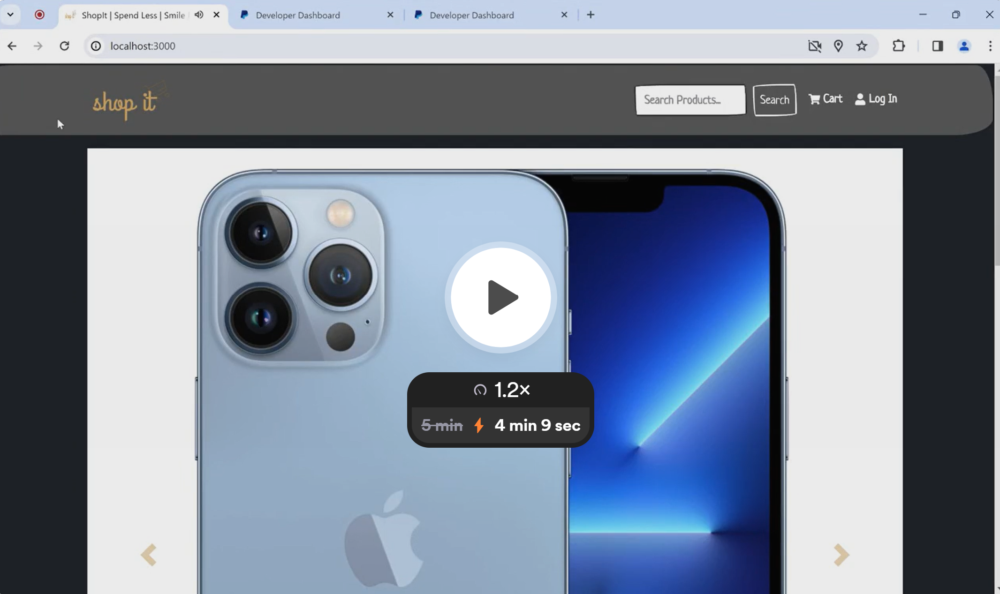
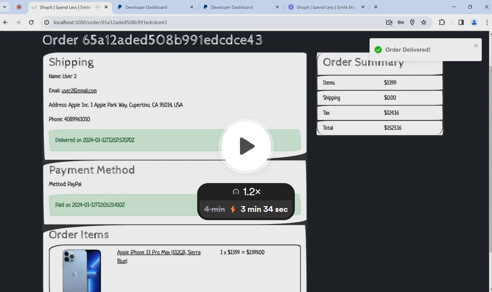

<a name="readme-top"></a>

[![Contributors][contributors-shield]][contributors-url]
[![Forks][forks-shield]][forks-url]
[![Stargazers][stars-shield]][stars-url]
[![Issues][issues-shield]][issues-url]
[![MIT License][license-shield]][license-url]
[![LinkedIn][linkedin-shield]][linkedin-url]
[![GitHub][github-shield]][github-url]

# [ShopIt] | Ecommerce Platform

<br />
<div align="center">
    


<h3 align="center">ShopIt</h3>

  <p align="center">
    ShopIt allows people to shop items and check their order status in the same platform. ShopIt helps people buy what they are looking for, in a fast and easy way without any advertisements.
    <br />
    <a href="https://github.com/GeorgiosIoannouCoder/shopit"><strong>Explore the docs »</strong></a>
    <br />
    <br />
    <a href="https://github.com/GeorgiosIoannouCoder/shopit/issues">Report Bug</a>
    ·
    <a href="https://github.com/GeorgiosIoannouCoder/shopit/issues">Request Feature</a>
  </p>
</div>

<details>
  <summary>Table of Contents</summary>
  <ol>
    <li>
      <a href="#about-the-project">About The Project</a>
      <ul>
        <li><a href="#key-features">Key Features</a></li>
        <li><a href="#built-with">Built With</a></li>
      </ul>
    </li>
    <li>
      <a href="#getting-started">Getting Started</a>
      <ul>
        <li><a href="#prerequisites">Prerequisites</a></li>
        <li><a href="#installation">Installation</a></li>
      </ul>
    </li>
    <li><a href="#usage">Usage</a></li>
    <li><a href="#demo">Demo</a></li>
    <li><a href="#contributing">Contributing</a></li>
    <li><a href="#license">License</a></li>
    <li><a href="#contact">Contact</a></li>
  </ol>
</details>

## About The Project

![Product Name Screen Shot][product-screenshot]

### ShopIt tries to solve the following problem statement in the film industry

- **People need to be able to buy what they are looking for fast and easy without any advertisements. People need to be aware of what they are going to buy through a great review system so that they know if that product is worth buying and spending money**

### Key Features

1. **Fully functional and responsive web application with the main focus on desktops, mobile devices, and tables.**
2. **Allow users to register, log in, and log out.**
3. **Allow user to registered using third-party authentication such as Google and GitHub.**
4. **Allow users to search for products.**
5. **Full description of each product with images.**
6. **A fully functional review system where registered users can make product reviews and ratings.**
7. **Full-featured shopping cart with a user-friendly checkout process.**
8. **No need to be a registered user to navigate and add products to the shopping cart, however only registered users can make purchases.**
9. **Allow registered users to access to their profiles and see, manage, and edit previous orders.**
10. **Allow registered users to update their profiles.**
11. **Display featured products in a carousel.**
12. **PayPal and credit/debit card payment integration to allow users to complete their purchases.**
13. **Fully functional and user-friendly admin panel to allow all admin users to see all listed products, add products, edit products, add customers, edit customers, edit orders, and upload photos.**
14. **Use React to create a single webpage application meaning that no reloading is done when changing pages.**
15. **Pagination for products, orders, and users. Only two items per page just for illustration purposes.**

<p align="right"><a href="#readme-top">Back to top</a></p>

### Built With

[![Figma][Figma]][Figma-url]
[![Postman][Postman]][Postman-url]
[![MongoDB][MongoDB]][MongoDB-url]
[![Node][Node.js]][Node-url]
[![Express][Express.js]][Express-url]
[![JWT][JWT]][JWT-url]
[![Passport][Passport]][Passport-url]
[![JavaScript][Javascript]][Javascript-url]
[![HTML][HTML]][HTML-url]
[![CSS][CSS]][CSS-url]
[![React][React]][React-url]
[![ReactIcons][ReactIcons]][ReactIcons-url]
[![Bootstrap][Bootstrap]][Bootstrap-url]
[![Git][Git]][Git-url]
[![Render][Render]][Render-url]
[![PayPalAPI][PayPalAPI]][PayPalAPI-url]

<p align="right"><a href="#readme-top">Back to top</a></p>

## Getting Started

**To get a local copy of ShopIt up and running locally follow these simple example steps:**

### Prerequisites

**NOTE:** How to check if Node and NPM are installed and what is their versions

```sh
  node -v
  npm -v
```

**NOTE:** How to check if Git is installed and what is its version

```sh
  git -v
```

1. Please make sure you have Node installed and use Node version: **v16.15.0**

   - You can use nvm to switch between different node versions:
     - Windows: [https://github.com/coreybutler/nvm-windows](https://github.com/coreybutler/nvm-windows)
     - Mac: [https://www.youtube.com/watch?v=BhLFxy6Jz8c](https://www.youtube.com/watch?v=BhLFxy6Jz8c)
     - Linux: [https://www.youtube.com/watch?v=tm1XllMkbAU](https://www.youtube.com/watch?v=tm1XllMkbAU)

1. Please make sure you have NPM installed (it usually comes with Node installation)

   ```sh
     npm install npm@latest -g
   ```

1. Please make sure you have git installed

   - Windows: [https://git-scm.com/download/win](https://git-scm.com/download/win)
   - Mac: [https://git-scm.com/download/mac](https://git-scm.com/download/mac)
   - Linux: [https://git-scm.com/download/linux](https://git-scm.com/download/linux)

1. Please make sure you have MongoDB Compass installed
   - MongoDB Compass: [https://www.mongodb.com/try/download/compass/](https://www.mongodb.com/try/download/compass)

### Installation

#### APIs

1. Get a free PayPal API Key at [https://developer.paypal.com/home](https://developer.paypal.com/home)

2. Get a free Google API Key at [https://console.developers.google.com](https://console.developers.google.com). (for Google third-party authentication)

   - When you sign-in to [https://console.developers.google.com](https://console.developers.google.com) create a new project.
   - Create OAuth 2.0 Client IDs.
   - Set Authorized JavaScript origins to: http://localhost:3000
   - Set Authorized redirect URIs to: http://localhost:5000/auth/google/callback

3. Get a free GitHub API Key at [https://github.com/settings/developers](https://github.com/settings/developers). (for GitHub third-party authentication)
   - When you sign-in to [https://github.com/settings/developers](https://github.com/settings/developers) create a new project.
   - Create OAuth 2.0 Client ID and Client Secret.
   - Set Homepage URL to: http://localhost:3000
   - Set Authorization callback URL to: http://localhost:5000/auth/github/callback

#### SetUp

1. Navigate to the directory where you want to clone/run/save the application

   ```sh
   cd your_selected_directory
   ```

2. Clone this repository

   ```sh
   git clone https://github.com/GeorgiosIoannouCoder/shopit.git
   ```

3. Navigate to the shopit git repository

   ```sh
   cd shopit
   ```

4. Install NPM packages

   ```sh
   npm i
   ```

5. Navigate to the frontend git repository

   ```sh
   cd frontend
   ```

6. Install NPM packages

   ```sh
   npm i
   ```

7. Navigate back to the root directory

   ```sh
   cd..
   ```

8. Create a .env file inside the shopit directory

   ```js
   NODE_ENV=development
   PORT=5000
   MONGO_URI=PLEASE ADD HERE YOUR MONGO_URI mongodb://127.0.0.1:27017/movierate_db
   JWT_SECRET=PLEASE ADD HERE YOUR JWT_SECRET
   PAYPAL_CLIENT_ID=PLEASE ADD HERE YOUR PAYPAL_CLIENT_ID
   ```

9. Run the application in development mode


   ```sh
   npm run dev
   ```

10.  Open MongoDB Compass and connect to the URI mongodb://127.0.0.1:27017/shopit. Here you will see your database shopit being created and the data of the web application

<p align="right"><a href="#readme-top">Back to top</a></p>

## Usage

1. Admin

   - Email: admin@email.com
   - Password: 12345678aA!

2. User
   - Email: user1@email.com
   - Password: 12345678aA!
  
3. User
   - Email: user2@email.com
   - Password: 12345678aA!

<p align="right"><a href="#readme-top">Back to top</a></p>

## Demo

<a href="https://www.loom.com/share/489b00b4ffc34b40bc3a89e967211993?sid=a0d75149-4f8e-415d-8716-9abd5c013116">
   
</a>

</br>

<a href="https://www.loom.com/share/af240f9a66a34d3296e11f218e406ad4?sid=2a580903-a82c-4c5e-ad41-3439dbb5ad57">
   
</a>

<p align="right"><a href="#readme-top">Back to top</a></p>

## Contributing

Contributions are what make the open source community such an amazing place to learn, inspire, and create. Any contributions you make are **greatly appreciated**.

If you have a suggestion that would make this better, please fork the repo and create a pull request. You can also simply open an issue with the tag "enhancement".
Don't forget to give the project a star! Thanks again!

1. Fork the Project
2. Create your Feature Branch (`git checkout -b feature/AmazingFeature`)
3. Commit your Changes (`git commit -m 'Add some AmazingFeature'`)
4. Push to the Branch (`git push origin feature/AmazingFeature`)
5. Open a Pull Request

<p align="right"><a href="#readme-top">Back to top</a></p>

## License

Distributed under the MIT License. See [LICENSE](https://github.com/GeorgiosIoannouCoder/shopit/blob/master/LICENSE) for more information.

MIT License

Copyright (c) 2023 Georgios Ioannou

Permission is hereby granted, free of charge, to any person obtaining a copy
of this software and associated documentation files (the "Software"), to deal
in the Software without restriction, including without limitation the rights
to use, copy, modify, merge, publish, distribute, sublicense, and/or sell
copies of the Software, and to permit persons to whom the Software is
furnished to do so, subject to the following conditions:

The above copyright notice and this permission notice shall be included in all
copies or substantial portions of the Software.

THE SOFTWARE IS PROVIDED "AS IS", WITHOUT WARRANTY OF ANY KIND, EXPRESS OR
IMPLIED, INCLUDING BUT NOT LIMITED TO THE WARRANTIES OF MERCHANTABILITY,
FITNESS FOR A PARTICULAR PURPOSE AND NONINFRINGEMENT. IN NO EVENT SHALL THE
AUTHORS OR COPYRIGHT HOLDERS BE LIABLE FOR ANY CLAIM, DAMAGES OR OTHER
LIABILITY, WHETHER IN AN ACTION OF CONTRACT, TORT OR OTHERWISE, ARISING FROM,
OUT OF OR IN CONNECTION WITH THE SOFTWARE OR THE USE OR OTHER DEALINGS IN THE
SOFTWARE.

<p align="right"><a href="#readme-top">Back to top</a></p>

## Contact

Georgios Ioannou - [@LinkedIn](https://linkedin.com/in/georgiosioannoucoder)

Georgios Ioannou - [@georgiosioannoucoder](https://georgiosioannoucoder.github.io/) - Please contact me via the form in my portfolio.

Project Link: [https://github.com/GeorgiosIoannouCoder/shopit](https://github.com/GeorgiosIoannouCoder/shopit)

<p align="right"><a href="#readme-top">Back to top</a></p>

[contributors-shield]: https://img.shields.io/github/contributors/GeorgiosIoannouCoder/shopit.svg?style=for-the-badge
[contributors-url]: https://github.com/GeorgiosIoannouCoder/shopit/graphs/contributors
[forks-shield]: https://img.shields.io/github/forks/GeorgiosIoannouCoder/shopit.svg?style=for-the-badge
[forks-url]: https://github.com/GeorgiosIoannouCoder/shopit/network/members
[stars-shield]: https://img.shields.io/github/stars/GeorgiosIoannouCoder/shopit.svg?style=for-the-badge
[stars-url]: https://github.com/GeorgiosIoannouCoder/shopit/stargazers
[issues-shield]: https://img.shields.io/github/issues/GeorgiosIoannouCoder/shopit.svg?style=for-the-badge
[issues-url]: https://github.com/GeorgiosIoannouCoder/shopit/issues
[license-shield]: https://img.shields.io/github/license/GeorgiosIoannouCoder/shopit.svg?style=for-the-badge
[license-url]: https://github.com/GeorgiosIoannouCoder/shopit/blob/master/LICENSE
[linkedin-shield]: https://img.shields.io/badge/-LinkedIn-black.svg?style=for-the-badge&logo=linkedin&colorB=0077B5
[linkedin-url]: https://linkedin.com/in/georgiosioannoucoder
[github-shield]: https://img.shields.io/badge/-GitHub-black.svg?style=for-the-badge&logo=github&colorB=000
[github-url]: https://github.com/GeorgiosIoannouCoder/
[product-screenshot]: frontend/public/logo192.png
[Figma]: https://img.shields.io/badge/figma-a259ff?style=for-the-badge&logo=figma&logoColor=1abcfe
[Figma-url]: https://www.figma.com/
[Postman]: https://img.shields.io/badge/postman-000000?style=for-the-badge&logo=postman&logoColor=orange
[Postman-url]: https://www.postman.com/
[MongoDB]: https://img.shields.io/badge/mongodb-001e2b?style=for-the-badge&logo=mongodb&logoColor=00ed64
[MongoDB-url]: https://www.mongodb.com/
[Node.js]: https://img.shields.io/badge/node.js-303030?style=for-the-badge&logo=nodedotjs&logoColor=3c873a
[Node-url]: https://nodejs.org/en
[Express.js]: https://img.shields.io/badge/express.js-000000?style=for-the-badge&logo=express&logoColor=ffffff
[Express-url]: https://expressjs.com/
[JWT]: https://img.shields.io/badge/JWT-black?style=for-the-badge&logo=JSON%20web%20tokens
[JWT-url]: https://jwt.io/
[Passport]: https://img.shields.io/badge/passport.js-000000?style=for-the-badge&logo=passport&logoColor=d4fd02
[Passport-url]: https://www.passportjs.org/
[JavaScript]: https://img.shields.io/badge/javascript-323330?style=for-the-badge&logo=javascript&logoColor=f0db4f
[JavaScript-url]: https://www.javascript.com/
[HTML]: https://img.shields.io/badge/html-e34c26?style=for-the-badge&logo=html5&logoColor=ffffff
[HTML-url]: https://developer.mozilla.org/en-US/docs/Web/HTML
[CSS]: https://img.shields.io/badge/css-e7eff6?style=for-the-badge&logo=css3&logoColor=264de4
[CSS-url]: https://developer.mozilla.org/en-US/docs/Web/CSS
[React]: https://img.shields.io/badge/React-20232A?style=for-the-badge&logo=react&logoColor=61DAFB
[React-url]: https://react.dev/
[ReactIcons]: https://img.shields.io/badge/react--icons-e91e63?style=for-the-badge
[ReactIcons-url]: https://react-icons.github.io/react-icons/
[Bootstrap]: https://img.shields.io/badge/bootstrap-e7eff6?style=for-the-badge&logo=bootstrap&logoColor=6762A6
[Bootstrap-url]: https://getbootstrap.com/
[Git]: https://img.shields.io/badge/git-000000?style=for-the-badge&logo=git&logoColor=orange
[Git-url]: https://git-scm.com/
[Render]: https://img.shields.io/badge/render-808080?style=for-the-badge&logo=render&logoColor=40e0d0
[Render-url]: https://render.com/
[PayPalAPI]: https://img.shields.io/badge/paypal-e7eff6?style=for-the-badge&logo=paypal&logoColor=3b7bbf
[PayPalAPI-url]: https://developer.paypal.com/home
